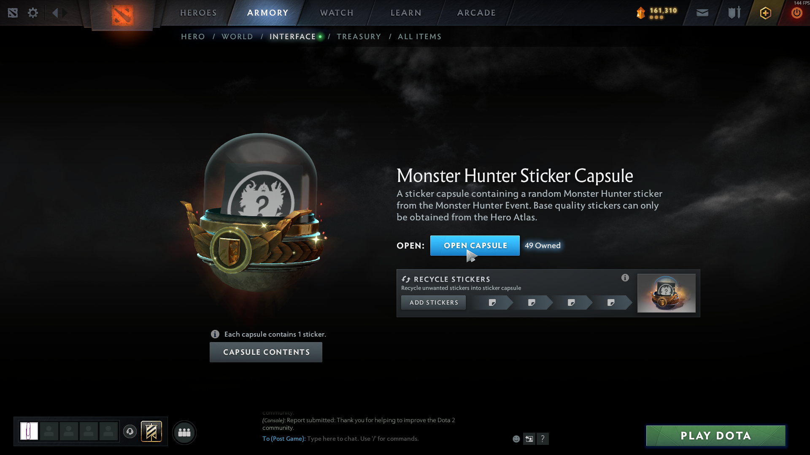
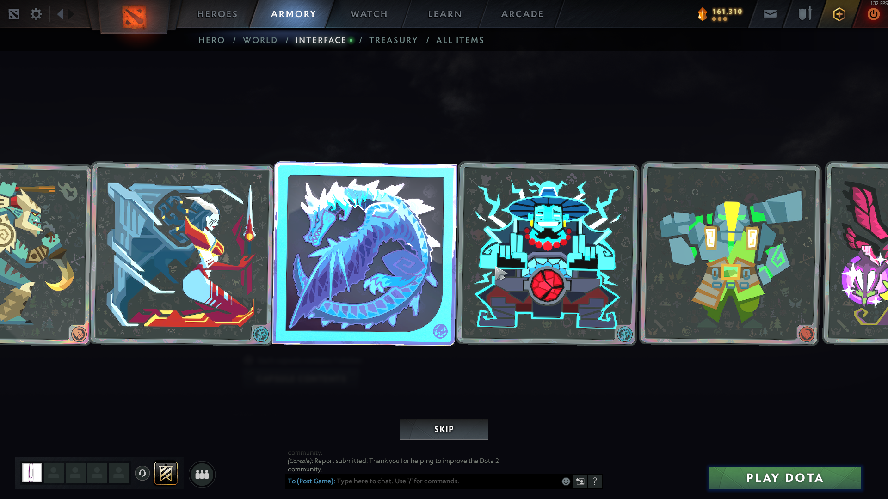

Stickers are admittedly largely worthless in Dota 2. Nevertheless, often you will get many for free from events, so you might as well open them. The problem is that you may get literally hundreds of stickers, and there is no "Open All" button. Ordinarily, you would have to click to open a capsule, move your mouse and click "Skip", then move your mouse back to "Open Another", and repeat. Especially with Dota's somewhat laggy interface, this takes forever.

Thankfully, there is a bit of a hacky way to massively speed this up. See, while the capsule is opening and it is pretending to simulate the spinning, the interface underneath is still live. So, the first step is to go the actual capsule in your Armory and click "Open Capsule":

Then once you click you, even though you see the spinner, just keep mindlessly clicking in that exact same spot. You should essentially see and hear the spinner repeatedly starting over, but you will just instantly be getting the items without dealing with the anti-user interface.

Then eventually you will run out of capsules and your clicks will just stop doing anything. This way you can open hundreds of capsules in just a few minutes.
