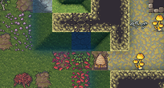
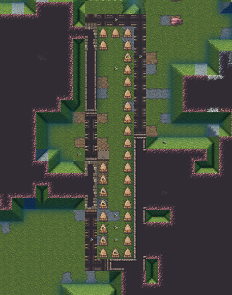

Honeymaking is an easy way to get a lot of food and drink, but it has a lot of parts to remember. One common error when you are first building hives is "No outdoor access". Even if you just built your hives near the mouth of a cave, you may think they can just fly out and get nectar from the flowers, but, uh, they can't.

Hives in Dwarf Fortress need to be outside. You may then think, "Well, I'll just dig the roof off," but that won't work either. Dwarf Fortress determines what is outside and inside based on what it is au naturel. Even if you strip mine a valley, the game will still consider it inside. You need to build your hives on the surface, not in a cave or a tunnel.

Note that a slope counts as outside. So in the above image, the hive is outside because it is in place of a slope that was dug out. That tile and the tiles left of it are valid places to put hives. The tiles to the right will never produce any honey.

One trick is though that this system goes both ways. You can build walls and a roof around your hives to make a fully-enclosed building and they will still be considered outside. Make the walls fortifications, and it's a good way to keep your apiarists safe and create an archery tower at the same time.

