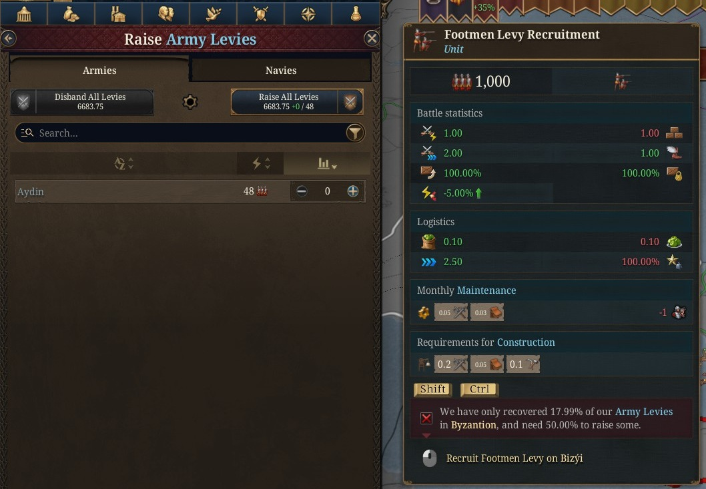

Throughout most of the game, levies are the core of your army. Especially in the early game, they are superior in both raw numbers and in utilizing the combat frontage. Levies are drawn from all your pops but are primarily made up of peasants.

Levies cost nothing to recruit and can be raised quickly. However, their main drawback is their fragility. Combat quality aside, when troops die, their pops disappear and the dead men can no longer be raised by you. For professional troops, this is less of an issue, as you can train troops from across your kingdom to refill your manpower reserves and upgrade buildings to increase it. Levies, on the other hand, are tied to their province, and when they die, you have to wait for it to naturally replenish.

How long does this take? Levies replenish at a rate of 1⁄300th of their size per month. This means that if a province's levies get wiped out, it will take *25 years* for them to fully replenish. You are unable to raise any levies from a province until it is at least half replenished, so it would take 12½ years before it contributes anything. This makes levy losses extremely devastating. As your control is centered on your capital, you must take special care to protect its levies, as it is unlikely you can make up for their loss elsewhere.

If you have lost your levies and you need to know how far into their replenishment you are, there is one awkward way to check. You have to already be at war, which hinders its usefulness, but then simply go to the military tab and attempt to manually raise levies from the province in question. As you hover over it, the tooltip will show you what percentage of levies are currently alive.

If your levies are replenished, but you are still unable to raise them, there may be other issues at play. See: [Why can't I raise levies?](../why-cant-i-raise-levies)

It is also of note that while disbanding an army will return its levies to their province, allowing you to re-raise them at any time at that strength, navies do not work this way. Raising naval levies is a one-time deal. Whenever naval levies are disbanded or destroyed, those boats are gone for good, and you must wait 25 years to raise them again. Thus, naval levies should be used as a last resort and as few raised each time as possible to avoid long downtimes of having no naval support.
