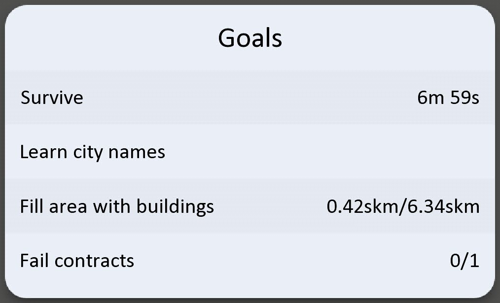
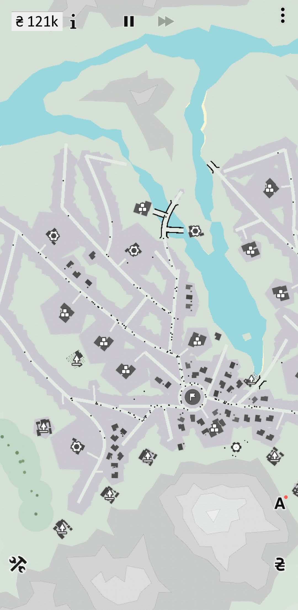
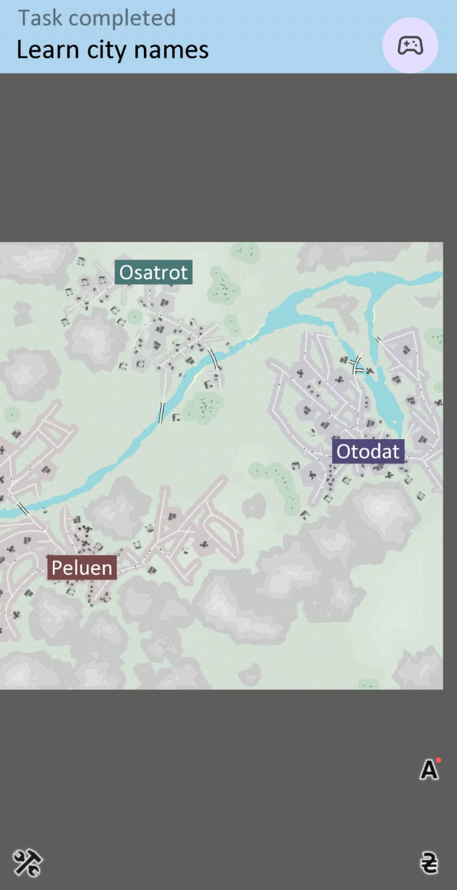
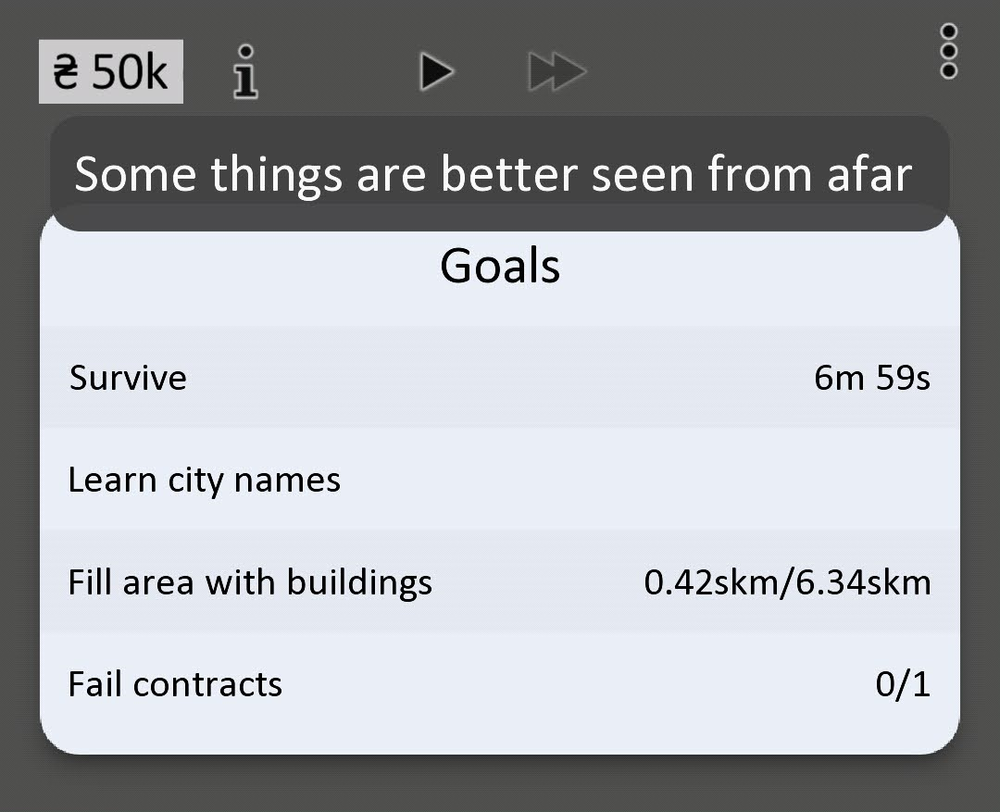

[Pochemeow](https://play.google.com/store/apps/details?id=yio.tro.meow&hl=en_US) is a clean, yet fairly complex, strategy game by the consistent developer Yiotro. The campaign mode is a series of levels where the first 16 or so build on each other, introducing new concepts and mechanics, essentially a form of tutorial. While some levels are a bit challenging and require some strategy, it pretty clearly explains what you are supposed to do and generally how to do it. One possible exception is level 11, where one of the listed goals is to "Learn city names". I may have missed something, but I don't recall any explicit instruction on how to do this.

One may think this involves tapping the cities or has to do with the newspaper or renaming cities or something. However, while you can see the names of cities via espionage, dirt, and renaming, none of these count. You need to learn which is where. The way to do this is simple but may not be something you do naturally.

See, just looking at a city normally doesn't show its name:

However, if you zoom out, the names appear, and you will fulfill the goal:

It's really that simple. Also, you can get a hint for this and other goals by tapping the goal itself if you get confused elsewhere:

